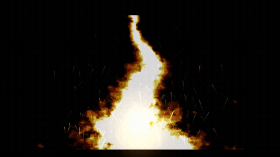

# motionpilot-ae-mcp

<p align="center">
  
</p>

A **local MCP server** for analyzing **PSD** files and building animated
**Adobe After Effects** projects, with saved `.aep` output and optional
`.mp4`/`.mov` previews.

The intended workflow: provide a PSD and a motion direction like *"Build a
premium After Effects animation where the title fades in, the mockup slides with
depth, UI cards stagger in, and the background has subtle parallax."* The server
then runs the tools below.

---

## Documentation

Start here if you are setting up or integrating the server:

| Guide | What it covers |
| --- | --- |
| [Install & build](#install--build) | Dependencies, build commands, and After Effects paths. |
| [MCP host configuration](#mcp-host-configuration) | Basic local MCP setup. |
| [Integrations](./docs/integrations.md) | Claude Desktop, Cursor, VS Code Copilot Agent mode, Codex, and ChatGPT/OpenAI notes. |
| [Example outputs & motion directions](#example-outputs--motion-directions) | Example JSON files and tool-call workflow. |
| [MCP host templates](./examples/mcp/) | Ready-to-edit config files for supported local hosts. |

---

## How it works

```
PSD ──▶ analyze_psd_visuals ──▶ analysis.json + preview.png + thumbnails/
                                    │
               inspect preview + structure
                                    │
        create_motion_plan_from_analysis ──▶ motion-plan.json
                                    │
         import_psd_to_after_effects ──▶ project.aep  (PSD as comp, retained layer sizes)
                                    │
       animate_after_effects_project ──▶ project_animated.aep  (keyframes + easing)
                                    │
                  render_preview ──▶ preview.mp4   (optional)
```

PSD parsing/preview/thumbnails happen in Node (`ag-psd` + `sharp`) — no
Photoshop required. After Effects is driven via generated **ExtendScript (JSX)**
run by the AE binary (`aerender` for headless rendering when available).

---

## MCP tools

| Tool | Purpose |
| --- | --- |
| `analyze_psd_visuals` | Flattened preview + per-layer thumbnails; extract name/order/bounds/opacity/visibility/type; detect naming patterns (`BG_`, `Text_`, `Title_`, `Subtitle_`, `Phone_`, `Mockup_`, `Card_`, `Button_`, `Icon_`, `Logo_`, `Particle_`, `Character_`, `LOCKED`); suggest a role + animation per layer; return structured JSON + image paths. |
| `create_motion_plan_from_analysis` | Turn the analysis + motion direction into a structured, hierarchy-aware motion plan. Never changes text; locked/text layers animate via transform/mask/range-selector only. |
| `create_video_prompt_package` | Turn a prompt and optional reference URL into a production-ready video package: creative brief, beat/shot list, AI-video prompts, and After Effects motion direction. |
| `create_image_asset_pack` | Generate procedural PNG assets from a prompt: background, hero object, connection rings, kinetic streaks, title plate, and CTA plate. |
| `create_3d_scene_from_assets` | Build a 3D/2.5D After Effects project from generated assets with camera, light, Z-depth, parallax, and orbital motion. |
| `import_psd_to_after_effects` | Open AE, import the PSD as a composition retaining layer sizes, set duration/FPS, save a new `.aep`. |
| `animate_after_effects_project` | Apply the motion plan as keyframes + easing (position, scale, opacity, rotation, blur, masks, parallax, stagger, light sweep) and save a new animated `.aep`. |
| `render_preview` | Render a comp to `.mp4`/`.mov` via `aerender` (or the AE render queue) and return logs + path. |
| `check_after_effects_setup` | Validate local `AE_BINARY` / `AERENDER_BINARY` resolution without launching After Effects. Good first smoke test after install. |
| `execute_after_effects_actions` | General AE control: create/list compositions, read project info, create text/shape/solid/adjustment/camera/null layers, edit layer properties/timing, toggle 2D/3D, set blend modes and track mattes, duplicate/delete layers, create masks, set keyframes, apply expressions, and batch-set properties. |
| `list_vfx_presets` | List the professional VFX preset library across **game**, **cinema** and **social** domains. Each preset is hybrid: it uses premium plugins (Trapcode Particular, Video Copilot Saber, Optical Flares) when installed and falls back to stock After Effects effects otherwise. |
| `apply_vfx` | Apply one or more VFX presets to an existing `.aep` comp and save a new copy. Comp-mode presets spawn their own layers (bursts, shockwaves, fire, fog, light rays); layer-mode presets decorate a `targetLayer` (neon glow, power aura, kinetic pop, glitch). Never modifies source text. |
| `create_vfx_composition` | Create a brand-new project with a standalone, reusable VFX element comp (explosion, magic circle, fog plate, fire column, laser beam) for compositing into other projects. |
| `build_complex_vfx` | Build DETAILED, production-grade **composite** VFX in one call. Each recipe stacks many layers/effects into a single professional result with an `intensity` control: `cinematicExplosion`, `magicCast`, `heroEntrance`, `celebration`, `powerSurge`, `stormScene`. Works on an existing AEP or spins up a fresh comp. |
| `create_game_vfx_from_prompt` | Create game-ready VFX directly from an English/Turkish prompt. Infers effect type, color, intensity and format, then creates a standalone VFX `.aep` or applies the result to an existing project. |
| `create_game_engine_vfx_package` | Create a Unity/Unreal-ready VFX package from a prompt: editable source `.aep`, manifest, sprite-sheet / PNG-sequence render targets, Unity import notes, Unreal/Niagara notes, and optional C4D/Cineware scene import when requested. |
| `create_raster_vfx_plate` | Create high-quality raster/noise/particle-field PNG frame sequences for professional VFX plates. This is the preferred quality path for fire, portals, magic energy, shockwaves, sparks and other detailed game VFX. |

### Professional VFX engine (game / cinema / social)

MotionPilot now ships a hybrid VFX engine. Discover effects with `list_vfx_presets`, then apply them with `apply_vfx`.

- **Game VFX** — `game.energy_burst` (radial particle explosion), `game.shockwave` (expanding distortion ring), `game.magic_circle` (rotating arcane sigil), `game.power_aura` (pulsing glow + rising embers on a hero layer), `game.hit_spark` (directional impact spark).
- **Cinema VFX** — `cinema.atmospheric_fog`, `cinema.light_rays` (volumetric god-rays), `cinema.lens_flare` (animated anamorphic flare), `cinema.fire` / `cinema.smoke` (procedural fractal-noise + turbulent-displace columns), `cinema.energy_beam` (Saber-or-stroke laser), `cinema.film_grain`, `cinema.color_grade` (grade + feathered vignette).
- **Social VFX** — `social.glitch` (RGB-split / block displacement hit), `social.rgb_split` (chromatic aberration), `social.neon_glow` (layered glow + flicker), `social.whip_pan` (fast directional-blur cut), `social.kinetic_pop` (scale-overshoot sticker pop).

**Advanced primitives** add deeper, multi-layer effects: `game.lightning_bolt` (branching arcs), `game.portal` (polar vortex), `game.force_field` (fresnel shield dome), `game.disintegrate` (Thanos-style dissolve), `game.sword_slash`, `game.speed_lines`, `game.charge_up`, `game.muzzle_flash`, `cinema.hologram`, `cinema.rain_storm`, `cinema.snow_fall`, `cinema.water_ripple`, `cinema.light_leak`, `ad.plexus_network`, `ad.bokeh`, `social.confetti`.

**Composite recipes** (via `build_complex_vfx`) stack these into one production-grade effect: `cinematicExplosion`, `magicCast`, `heroEntrance`, `celebration`, `powerSurge`, `stormScene` — each with an `intensity` (0.2–3) that scales the entire stack.

**Hybrid behavior:** each effect probes for its premium plugin first (e.g. `Trapcode Particular` for bursts, `ADBE Saber` for beams, `Optical Flares` for flares, `CC Rainfall`/`CC Snowfall` for weather, `Trapcode Form` for plexus) and silently falls back to a stock-AE build so scripts run on any clean install.

### Prompt-to-game VFX

Use `create_game_vfx_from_prompt` when you want to type a VFX idea instead of manually picking presets. It understands English and Turkish cues such as `patlama`, `ateş`, `şimşek`, `kalkan`, `portal`, `büyü çemberi`, `enerji patlaması`, `sword slash`, `muzzle flash`, `shockwave`, and color/intensity words like `mavi`, `mor`, `devasa`, `hafif`.

Standalone VFX element:

```json
{
  "prompt": "devasa mavi büyü patlaması, shockwave ve kıvılcımlar, horizontal",
  "outputAepPath": "/Users/me/vfx/blue_magic_blast.aep",
  "duration": 5,
  "fps": 30,
  "approveOverwrite": true
}
```

Apply prompt-generated VFX to an existing project:

```json
{
  "prompt": "elektrikli kalkan darbesi, cyan, yoğun",
  "aepPath": "/Users/me/game_scene/game_scene.aep",
  "outputAepPath": "/Users/me/game_scene/game_scene_shield_vfx.aep",
  "compName": "Main",
  "targetLayer": "Hero_",
  "position": [960, 540],
  "approveOverwrite": true
}
```

### Unity / Unreal engine VFX packages

Use `create_game_engine_vfx_package` when the prompt asks for Unity, Unreal,
Niagara, VFX Graph, sprite sheets, flipbooks, or engine-ready game assets. With
`engine: "auto"`, MotionPilot infers the target from the prompt; if no engine is
mentioned, it defaults to Unity. The package includes:

- editable After Effects source `.aep`
- `manifest.json` with frame count, FPS, alpha, blend mode, pivot and render targets
- Unity import notes for Particle System / VFX Graph / URP / HDRP
- Unreal import notes for Niagara / SubUV / translucent or additive materials
- render instructions for PNG sequence and sprite-sheet workflows

Example:

```json
{
  "prompt": "looping blue magic portal for Unity VFX Graph, additive flipbook",
  "outputFolder": "/Users/me/vfx/blue_portal_unity",
  "engine": "auto",
  "exportKind": "both",
  "frameWidth": 1024,
  "frameHeight": 1024,
  "duration": 2,
  "fps": 30,
  "loop": true,
  "blendMode": "additive",
  "approveOverwrite": true
}
```

If the user explicitly wants Cinema 4D/Cineware, set `c4dMode` and optionally
provide a `.c4d` scene:

```json
{
  "prompt": "Unreal Niagara fire portal using Cinema 4D geometry and AE glow compositing",
  "outputFolder": "/Users/me/vfx/fire_portal_unreal",
  "engine": "unreal",
  "c4dMode": "use",
  "c4dScenePath": "/Users/me/scenes/portal.c4d",
  "exportKind": "pngSequence",
  "approveOverwrite": true
}
```

When C4D is requested, MotionPilot attempts to import the `.c4d` scene into the
AE source comp through the local After Effects/Cineware path. If no C4D scene is
provided, it still creates an AE-only package unless `c4dMode` is `require`.

### Professional raster VFX quality bar

For detailed game VFX, MotionPilot should prefer raster/noise/particle-field
plates over geometric-looking AE shape fallbacks. Fire, portals, magic energy,
shockwaves and spark-heavy effects should be generated as organic PNG frame
sequences that can be imported into After Effects, Unity or Unreal.

Example prompt:

```text
Create fire
```

Example output quality target:



Use `create_raster_vfx_plate` directly when you want a high-quality image
sequence, or use engine package tools when you need Unity/Unreal import
metadata around the same kind of plate.

The motion planner also gained VFX-grade animation types usable in motion plans: `elasticScale`, `glitchIn`, `neonFlicker`, `chromaSplit`, `flip3D`, `energyTrail`, `motionStreak`, `kineticBounce`.

### Direction-driven professional motion

`create_motion_plan_from_analysis` reads the animation direction and detects
cues like:

- `cinematic`, `camera`, `trailer` -> subtle AE camera push
- `depth`, `parallax`, `3D` -> stronger layered parallax/depth drift
- `kinetic typography`, `headline`, `type` -> text-safe range reveals
- `glow`, `shine`, `light sweep`, `neon` -> glow and sweep accents
- `app`, `SaaS`, `dashboard`, `UI`, `product promo` -> staggered product/UI hierarchy
- `Reels`, `TikTok`, `Shorts`, `fast`, `energetic` -> tighter, faster timing
- `minimal`, `clean`, `subtle` -> restrained density
- `Behance`, `portfolio`, `commercial`, `advert`, `launch` -> richer professional polish

The generated motion plan includes a `promptProfile` with inferred `tempo`,
`density`, `direction`, and `professionalTouches`.

Additional animation types available to generated plans:
`blurFade`, `overshootPop`, `rotateIn`, `depthDrift`, `scalePulse`,
`ambientGlow`, and `cameraPush`.

### Procedural custom motion

MotionPilot can also generate custom motion behaviors that are not standard
After Effects animation presets. These are built from procedural expressions,
keyframes, and native AE properties:

- `magneticSnap` — overshooting snap-in with position and scale tension
- `liquidDrift` — organic drifting motion for backgrounds and accents
- `cinematicJitter` — subtle handheld-style movement
- `microShake` — controlled impact shake for CTA or emphasis moments
- `revealWipeBlur` — wipe reveal with blur cleanup
- `parallaxOrbit` — orbital parallax for depth layers
- `breathBlur` — gentle breathing scale with animated blur
- `typewriterFlicker` — text-safe flicker/reveal without changing source text

### Prompt-to-video packages

`create_video_prompt_package` prepares a structured package for brand films,
social ads, abstract motion, product promos, or cinematic clips. It does not
call a video model by itself; it creates:

- creative brief
- timed beat/shot list
- AI-video prompts for short segments
- After Effects motion direction using MotionPilot animation types
- constraints and avoid notes for safer generation

Reference URLs can be used for direction, but the package is designed to avoid
copying the source video.

### Prompt-to-3D After Effects scenes

The server can create visual assets and assemble them into a 3D/2.5D After
Effects scene:

1. `create_image_asset_pack` generates PNG assets plus `asset-manifest.json`.
2. `create_3d_scene_from_assets` imports those assets into AE, places them as
   3D layers, adds camera and light, then applies parallax/orbit expressions.
3. `render_preview` can render the result when the project is approved.

This first implementation generates procedural image assets locally. It is
designed so external image-generation outputs can be added later through the
same manifest format.

### General AE actions

`execute_after_effects_actions` runs a batch of actions against either a new
project or an existing `.aep`. Mutating actions require `outputAepPath`; the
source project is opened and a new copy is saved.

Example:

```json
{
  "outputAepPath": "/tmp/motionpilot-demo.aep",
  "actions": [
    {
      "type": "createComposition",
      "name": "Main",
      "width": 1920,
      "height": 1080,
      "fps": 30,
      "duration": 8,
      "backgroundColor": [0.02, 0.02, 0.025]
    },
    {
      "type": "createTextLayer",
      "compName": "Main",
      "name": "Title",
      "text": "MotionPilot",
      "fontSize": 96,
      "color": [1, 1, 1],
      "position": [960, 420]
    },
    {
      "type": "createShapeLayer",
      "compName": "Main",
      "name": "Accent Star",
      "shapeType": "star",
      "points": 5,
      "outerRadius": 80,
      "innerRadius": 36,
      "fillColor": [0.2, 0.75, 1],
      "position": [960, 560]
    },
    {
      "type": "setKeyframes",
      "compName": "Main",
      "layerName": "Title",
      "property": "opacity",
      "keyframes": [
        { "time": 0, "value": 0 },
        { "time": 1, "value": 100 }
      ],
      "ease": "expoOut"
    }
  ]
}
```

Inspection-only calls can omit `outputAepPath`:

```json
{
  "aepPath": "/tmp/motionpilot-demo.aep",
  "actions": [{ "type": "getProjectInfo" }, { "type": "listCompositions" }]
}
```

### JSX helper library

Generated scripts include these ExtendScript helpers (`src/ae/jsxHelpers.ts`):
`findLayersByPattern`, `setEase`, `addPositionAnimation`, `addScaleAnimation`,
`addOpacityAnimation`, `addRotationAnimation`, `addBlurAnimation`,
`addMaskReveal`, `addTextRangeReveal`, `addParallax`, `addStaggeredReveal`,
`addLightSweep`, `protectTextLayer`, `saveProject`.

---

## Safety rules (enforced)

- **Never modifies the source PSD** — it is opened read-only.
- **Never overwrites files** unless you pass `approveOverwrite: true`.
- **Never deletes files.**
- **Always saves a new AEP** rather than editing in place.
- **Preserves text content** — when `preserveTextContent` is true, `sourceText`
  is never touched; text layers animate only via transform/mask/range selector.
- Returns clear logs after every operation and a clear error if After Effects
  cannot be found.

---

## Requirements

- **Node.js ≥ 18**
- **Adobe After Effects** (2023 or newer) installed locally, for the AE-driven
  tools. The analysis + motion-plan tools work without AE.
- macOS or Windows.

---

## Install & build

```bash
cd motionpilot-ae-mcp
npm install
npm run build        # compiles TypeScript to dist/
npm run ci           # typecheck + build, same checks used by GitHub Actions
```

If `sharp` fails to install on your platform, see https://sharp.pixelplumbing.com/install.

### Point the server at After Effects

The server auto-detects common install paths. If yours differs, set env vars:

```bash
# macOS
export AE_BINARY="/Applications/Adobe After Effects 2025/Adobe After Effects 2025.app"
export AERENDER_BINARY="/Applications/Adobe After Effects 2025/Adobe After Effects 2025.app/Contents/aerender"

# Windows (PowerShell)
$env:AE_BINARY="C:\Program Files\Adobe\Adobe After Effects 2025\Support Files\AfterFX.exe"
$env:AERENDER_BINARY="C:\Program Files\Adobe\Adobe After Effects 2025\Support Files\aerender.exe"
```

> In After Effects, enable **Preferences → Scripting & Expressions → Allow
> Scripts to Write Files and Access Network** so generated JSX can save projects.

---

## MCP host configuration

Add this server to an MCP host config. A ready
example is in [`claude_desktop_config.example.json`](./claude_desktop_config.example.json):

```json
{
  "mcpServers": {
    "motionpilot-ae": {
      "command": "node",
      "args": ["/ABSOLUTE/PATH/TO/motionpilot-ae-mcp/dist/index.js"],
      "env": {
        "AE_BINARY": "/Applications/Adobe After Effects 2025/Adobe After Effects 2025.app"
      }
    }
  }
}
```

Restart the host application; the tools appear automatically.

Run `check_after_effects_setup` first. It should return the resolved After
Effects app path and `aerender` path before you run import/animate/render tools.

More host examples are available in [`docs/integrations.md`](./docs/integrations.md),
including Claude Desktop, Cursor, VS Code Copilot Agent mode, Codex, and notes
for ChatGPT/OpenAI remote MCP support.

---

## Run as a remote server (ChatGPT / OpenAI API)

Local hosts (Claude Desktop, Cursor, VS Code, Codex) launch the server over
**stdio** with `dist/index.js`. ChatGPT custom connectors and the OpenAI
Responses API instead need a **remote Streamable HTTP** URL, so the project also
ships an HTTP entrypoint (`dist/http.js`) that exposes the same tools.

```bash
npm install
npm run build

# Localhost only, no auth (first local test):
npm run start:http
# -> motionpilot-ae-mcp HTTP transport on http://127.0.0.1:8787/mcp

# Recommended when exposing it — require a bearer token:
MOTIONPILOT_HTTP_TOKEN="choose-a-long-secret" npm run start:http
```

| Env var | Default | Purpose |
| --- | --- | --- |
| `PORT` | `8787` | HTTP port. |
| `HOST` | `127.0.0.1` | Bind address. Use `0.0.0.0` only behind a tunnel/proxy. |
| `MOTIONPILOT_HTTP_TOKEN` | _(unset)_ | If set, every request must send `Authorization: Bearer <token>`. |
| `AE_BINARY` / `AERENDER_BINARY` | auto-detect | After Effects paths. |

Then expose it over HTTPS and connect ChatGPT:

```bash
cloudflared tunnel --url http://127.0.0.1:8787   # or: ngrok http 8787
```

In **ChatGPT → Settings → Connectors → Add custom connector**, set the MCP
server URL to `https://<tunnel-host>/mcp` (and the bearer token if you enabled
one). Full walkthrough + an OpenAI Responses API snippet:
[`docs/integrations.md`](./docs/integrations.md) and
[`examples/mcp/chatgpt_remote.json`](./examples/mcp/chatgpt_remote.json).

> ⚠️ This server can open After Effects, write `.aep` files, render video, and
> delete layers. **Never expose it publicly without a bearer token and a
> controlled tunnel.**

---

## Compatibility

**Operating systems**

| OS | Status | Notes |
| --- | --- | --- |
| macOS (Apple Silicon & Intel) | ✅ Supported | After Effects path under `/Applications/...`. |
| Windows 10 / 11 | ✅ Supported | After Effects path under `C:\Program Files\Adobe\...`. |
| Linux | ⚠️ Partial | PSD analysis + motion-plan + video/asset tools work; AE-driven tools (import/animate/render) require After Effects, which Adobe does not ship for Linux. |

**Runtime**

- Node.js ≥ 18 (Node 20 LTS recommended).
- Adobe After Effects 2023 or newer for the AE tools. The `analyze_psd_visuals`,
  `create_motion_plan_from_analysis`, `create_video_prompt_package`,
  `create_image_asset_pack` tools run without After Effects.

**MCP hosts / clients**

| Client | Transport | Status |
| --- | --- | --- |
| Claude Desktop | stdio | ✅ |
| Cursor | stdio | ✅ |
| VS Code Copilot Agent mode | stdio | ✅ |
| Codex CLI / IDE | stdio | ✅ |
| ChatGPT custom connectors | remote Streamable HTTP | ✅ (`npm run start:http` + tunnel) |
| OpenAI Responses API `mcp` tool | remote Streamable HTTP | ✅ |

> The bundled `node_modules` and `dist/` are **not** committed (see
> `.gitignore`). On any machine, clone the repo then run `npm install` +
> `npm run build` so native modules (`sharp`, `@napi-rs/canvas`) compile for
> that platform.

---

## Example outputs & motion directions

- [`examples/analysis.example.json`](./examples/analysis.example.json)
- [`examples/motion-plan.example.json`](./examples/motion-plan.example.json)
- [`examples/prompts.md`](./examples/prompts.md) — full end-to-end direction and the
  exact tool-call sequence.
- [`examples/mcp/`](./examples/mcp/) — MCP host configuration templates.

---

## Naming conventions in your PSD (recommended)

Prefix layers so role detection is exact (otherwise heuristics are used):

```
BG_*        background (parallax)
Title_*     / Text_Title_*    title
Subtitle_*  / Text_Subtitle_* subtitle
Text_*      generic text
Phone_*     phone mockup       Mockup_*  main mockup
Card_*      UI card (staggered) Button_* button (bounce)
Icon_*      icon (float)        Logo_*   logo (soft reveal)
Particle_*  / decorative        Character_* character
*LOCKED*    protect text — transform-only animation
```

---

## Project layout

```
src/
  index.ts              MCP server, registers all tools
  schemas.ts            Zod input schemas
  types.ts              Shared domain types
  util.ts               Logging, fs guards, overwrite protection
  psd/
    roles.ts            Naming-pattern + role + animation detection
    analyzer.ts         PSD read, preview/thumbnail export, report
  motion/
    planner.ts          Hierarchy-aware motion plan builder
  ae/
    jsxHelpers.ts       Embedded ExtendScript helper library
    jsxGenerator.ts     Import / animate / render JSX generators
    runner.ts           Resolves & runs AE / aerender, parses results
examples/               Example JSON + prompts
claude_desktop_config.example.json
```

## License

MIT
